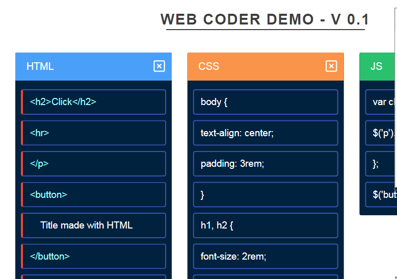

We are (or I am?) proud to announce yet another experimental and educational game in the beginning of the year 2019. Super Web Coder - A Game of Html + Css + Js, where you arrange the code to get the target website design as shown. Currently only a single demo level is available for playing. Your feedback is greatly appreciated.

### Here's the game in action

## [You can play it here](https://monsterbrain.github.io/web-supercoder-the-game/)

### Inspired by

- [Muuri Javascript Library](https://github.com/haltu/muuri) especially it's **kanban demo**

### [View the source on Github](https://github.com/monsterbrain/web-supercoder-the-game)

*Feel free to contribute new levels or fork it to use it for other coding or games as well*

Thanks for playing!
